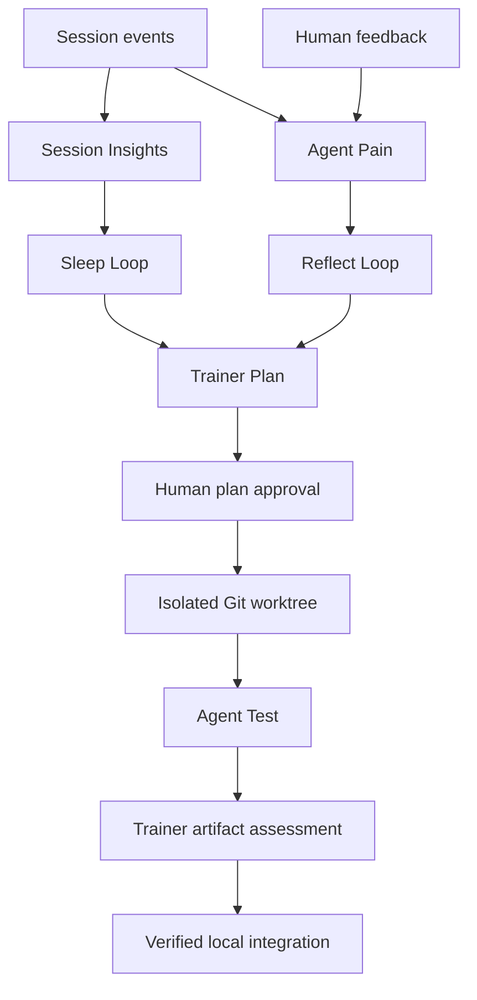

# Architecture

Forge plugins run inside DeepSeek Harness. Harness owns sessions, tools, model
providers, shell execution and Web transport. Forge adds evidence and improvement
workflows using those public services.

Session Insights captures immutable revisions and bounded query/read responses.
Pain persists feedback facts. Reflection and Sleep deliver work to Trainer.
Trainer stores plans, proposals, evaluations and result Markdown. Human Request
persists plan decisions before resuming the owning session. Agent Test copies
source and local dependencies into an isolated snapshot before starting Harness.
Review Agent can inspect frozen material and return a structured assessment.

`DSH_HOME` selects runtime storage and defaults to `.runtime`. Existing persistence
names, including `trainning`, are stable storage contracts. A training operation
has one project root and one target repository. Local dependencies are frozen as
evaluation inputs, while changes are made in the selected project's worktree.

Runtime composition loads shared presets, overlays application presets, and
resolves public package exports. Shared host patch rows precede application patch
rows. Plugin registration and runtime links use installed packages, not source imports.
